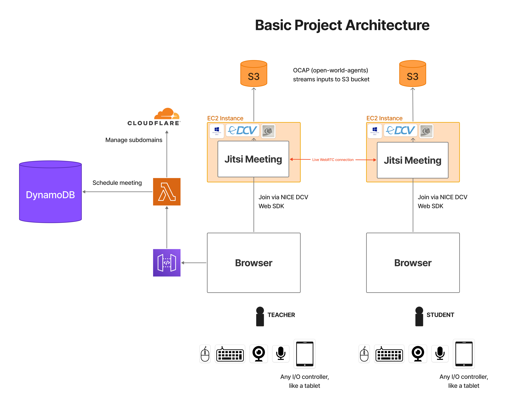

# Introduction

This project is built on several fundamental components that work together to create a scalable cloud framework for capturing training data for desktop agents. Each component plays a crucial role in the overall system.

## Components Overview

- **[Jitsi Meet](jitsi-meet.md)** - Video conferencing infrastructure for real-time communication
- **[NICE DCV](nice-dcv.md)** - Remote desktop protocol enabling multi-user access to virtual machines
- **[Open World Agents](open-world-agents.md)** - Desktop interaction capture system using OCAP
- **[Windows](windows.md)** - Operating system configuration and kiosk mode setup
- **[Amazon Web Services](amazon-web-services.md)** - Cloud infrastructure and services

Each of these components has its own challenges and "gotchas" that I'll walk you through. Click on any component above to learn more about it, or continue reading below for a high-level overview.

## How They Work Together

The system architecture leverages these components to create a seamless experience:

1. **Jitsi Meet** provides the video conferencing layer for real-time communication
2. **NICE DCV** enables remote desktop access to powerful cloud workstations
3. **Open World Agents (OCAP)** captures all desktop interactions in a standardized format
4. **Windows Server** provides the operating system foundation with kiosk mode for secure, single-app sessions
5. **AWS** hosts everything in the cloud, providing scalability and reliability

This combination allows you to capture multimodal training data (screen, audio, mouse, keyboard) from any desktop application, whether it's Minecraft, Excel, or trading Memecoins, the inputs remain the same.

