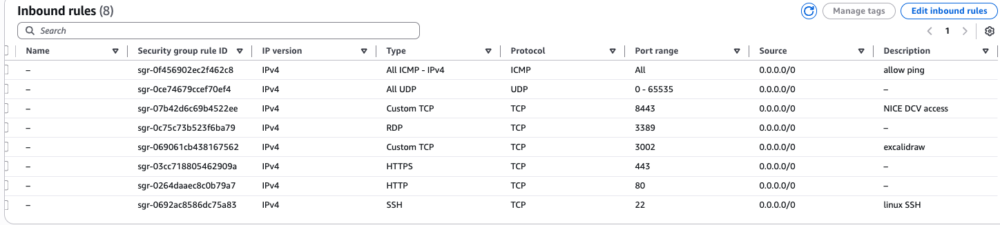

# EC2 Setup

This guide walks you through setting up a Windows Server EC2 instance that will serve as your remote desktop environment.

## Launching Your EC2 Instance

Navigate to the EC2 service in the AWS Console and click **Launch Instance**.

## Instance Configuration

You have considerable flexibility in how you configure your EC2 instance. Here's what I recommend and why:

### AMI Selection

**Microsoft Windows Server 2022 Base**

- We need Windows because OCAP requires it
- Only Windows DCV supports webcam access
- Use the most recent Windows Server version available

### Instance Type

**t3.xlarge** (4 vCPUs, 16 GB RAM)

!!! note "Instance Type Selection"
    The T3 series is like picking Mario in Mario Kart—kinda basic, but you can't go wrong with it. It's the most popular choice for general-purpose workloads.

    If you're on the free tier, use the largest instance type available to you. You may not even need 16GB RAM for your use case—you can always adjust later once you're comfortable with EC2.

### Key Pair

**Create new key pair**

!!! info "Key Pairs"
    Key pairs provide an additional layer of security when accessing EC2 instances. You'll create the public/private key pair in your AWS account and keep the private key on your local machine.

### Storage

**Use default settings for now**

!!! note "Storage Management"
    You can always add more storage later if needed. I initially added storage for NVIDIA drivers, but it turned out to be unnecessary.

## Security Groups Configuration

Security groups act as virtual firewalls that control traffic to your EC2 instances. Proper configuration is essential for both security and functionality.

### Security Group Best Practices

!!! warning "Avoid This Mistake"
    
    
    **Don't do this!** The configuration shown above is messy and not recommended.

    You should ideally create a separate security group for each purpose. For example, if one EC2 is running your DCV session and another is running a Jitsi server, the ports you need are different.

### Required Security Group Rules

Here are the ports you'll need to open for this setup:

| Type | Protocol | Port Range | Source | Description |
|------|----------|------------|--------|-------------|
| RDP | TCP | `3389` | `My IP` | Initial Install & Backup Access |
| **Custom TCP** | TCP | `8443` | `0.0.0.0/0` | NICE DCV (Web/Client) |
| **Custom UDP** | UDP | `8443` | `0.0.0.0/0` | NICE DCV (QUIC Support) |
| **Custom UDP** | UDP | `10000` | `0.0.0.0/0` | Jitsi Meet (Media/VideoBridge) |
| **HTTP** | TCP | `80` | `0.0.0.0/0` | Jitsi Meet (Web Access) |
| **HTTPS** | TCP | `443` | `0.0.0.0/0` | Jitsi Meet (Web Access) |
| **SSH** | TCP | `22` | `My IP` | SSH Access (Admin) |

!!! tip "Source IP Configuration"
    - Use `My IP` for RDP and SSH to restrict access to your current IP address
    - Use `0.0.0.0/0` for services that need to be publicly accessible (DCV, Jitsi)
    - You can always tighten security later by restricting to specific IP ranges

### Port Explanations

- **3389 (RDP)**: Required for initial connection to Windows before DCV is set up
- **8443 (DCV)**: Default port for NICE DCV connections
- **10000 (Jitsi UDP)**: Required for Jitsi Meet media streaming
- **80/443 (HTTP/HTTPS)**: Required for Jitsi Meet web access
- **22 (SSH)**: Useful for administrative tasks (optional for Windows instances)

## Launch the Instance

Once you've configured all settings including the security group, click **Launch Instance** to create your EC2 instance.

---

**Next: [DCV Setup →](dcv.md)**

