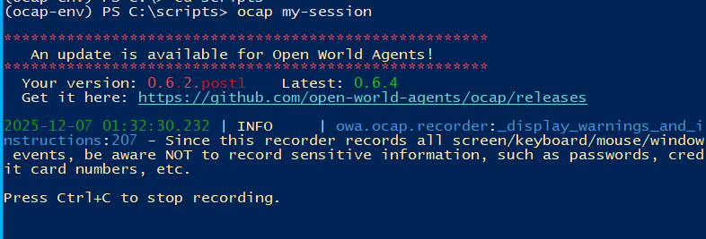
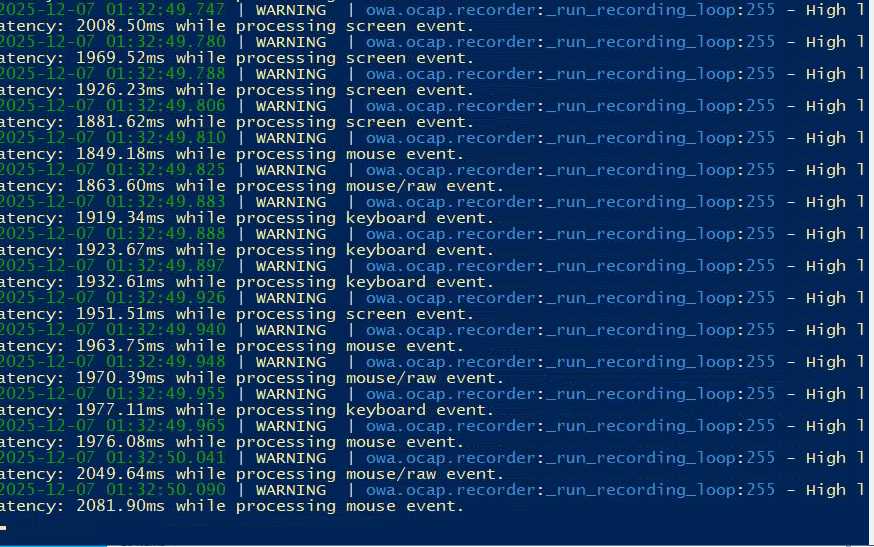

# OCAP Installation

OCAP (Open-World Agent Capture) is the desktop interaction capture system we'll use to record screen, audio, and input data. This section covers the installation and configuration process.

## Directory Structure

First, set up the required directory structure on your EC2 at the `C:\` root level:

```
C:\scripts\
├── pid\
│   └── (PID files will be written here - see fork documentation)
├── temp_recordings\
│   └── (OCAP will write recordings here)
├── meeting\
│   └── (meeting metadata will go here)
└── (scripts go here)

C:\projects\
└── (OCAP repository will go here)
```

## Downloading the OCAP Fork

Download the custom OCAP fork as a ZIP file:

**Repository**: https://github.com/shaundano/elephant-ocap

Extract the ZIP file into the `C:\projects\` folder.

!!! info "Why Use This Fork?"
    This fork includes several customizations that allow it to run on non-GPU EC2 instances and includes additional features like microphone capture. See the [Fork Discussion](fork-discussion.md) for technical details.

## Installing Miniconda3

OCAP requires Conda as a package manager (used by Open World Agents). Install Miniconda3 via PowerShell:

```powershell
Invoke-WebRequest -Uri "https://repo.anaconda.com/miniconda/Miniconda3-latest-Windows-x86_64.exe" -OutFile ".\Downloads\Miniconda3-latest-Windows-x86_64.exe"
```

Run the installer. If given the option to install for all users, **accept it**.

!!! success "Installation Complete"
    Once installed, you should see `(base)` in your PowerShell prompt, indicating that Conda is active.

## Creating the Conda Environment

Create a new Conda environment for OCAP:

```bash
conda create -n ocap-env python=3.14
```

Activate the environment:

```bash
conda activate ocap-env
```

You should now see `(ocap-env)` in your terminal prompt.

## Installing OCAP

Navigate to the OCAP project folder in PowerShell, then install it in editable mode:

```python
pip install -e .
```

!!! tip "Editable Mode"
    The `-e` flag installs in editable mode, which is like debug mode or hot refresh. If dependencies change in the Python project, it should automatically react. The dependencies are defined in `pyproject.toml`.

### Installing GStreamer Dependencies

Follow the official OCAP documentation and install GStreamer dependencies:

```python
# Install GStreamer dependencies first (for video recording)
conda install open-world-agents::gstreamer-bundle

```

The regular documentation says to also run `pip install ocap`, but since we downloaded it locally, we don't need to do that.

## Running OCAP

You should now be ready to run OCAP. Execute:

```python
ocap my-recording
```

This will write files to the default path, which is `C:\`.

### Success Indicators

If everything is working correctly, you should see output similar to:




## Troubleshooting

### Common Issues

!!! warning "Don't Give Up!"
    Getting OCAP to run was one of the **hardest parts of this project to debug**. Once it worked, I didn't even really understand why it started working.

### Environment Activation

Make sure your Conda environment is activated. You should see `(ocap-env)` on your terminal line.

### Missing GStreamer Components

**Error**: `no module 'gi' found`

OCAP uses many different GStreamer components, and sometimes they'll be missing. Try:

1. Re-installing the GStreamer plugins from open-world-agents
2. Adding the `conda-forge` channel (should be enabled by default, but sometimes it isn't):

```python
conda config --add channels conda-forge
```

### Why Use the Fork Instead of pip install?

By downloading the project directly onto your EC2, you're able to rely on your own local repository rather than `pip install ocap`, which uses the most recent version. This gives you visibility into the dependencies you need in `pyproject.toml` and allows you to customize the code if needed.

---

**Next: [Fork Discussion →](fork-discussion.md)**

