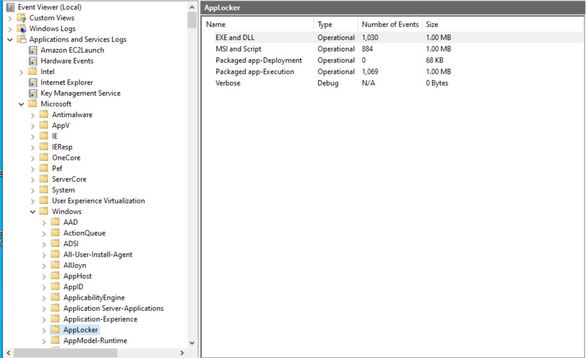

# AppLocker Configuration

AppLocker is a Windows method that allows you to block certain applications for certain users, such as Task Manager for KioskUser.

!!! info "Note - Application Identity Service"
    AppLocker requires the "Application Identity" service to be running.

## Part 1: Block Task Manager via AppLocker

### Step 1: Open Policy Editor

1. Run `secpol.msc`.

### Step 2: Create Default Rules (Vital)

1. Navigate to **Application Control Policies** > **AppLocker** > **Executable Rules**.
2. Right-click and select **Create Default Rules** (prevents you from locking yourself out).
3. Also do it for **Script Rules**. Some of our code counts as an executable, some as scripts.


This is what mine looks like.

#### Executable Rules

| **Action** | **User** | **Name/Path** | **Condition** |
|------------|----------|---------------|---------------|
| ✅ Allow | Everyone | `C:\Users\Administrator\Miniconda3\*` | Path |
| ✅ Allow | Everyone | `C:\projects\*` | Path |
| ✅ Allow | Everyone | (Default Rule) All files located in the Program Files folder | Path |
| ✅ Allow | Everyone | `C:\Users\KioskUser\*` | Path |
| ✅ Allow | Everyone | (Default Rule) All files located in the Windows folder | Path |
| 🚫 Deny | EC2AMAZ-GPDFMFQ\KioskUser | `C:\Windows\System32\Taskmgr.exe` | Path |
| ✅ Allow | Everyone | `C:\scripts\*` | Path |
| ✅ Allow | BUILTIN\Administrators | (Default Rule) All files | Path |

#### Script Rules

| **Action** | **User** | **Name/Path** | **Condition** |
|------------|----------|---------------|---------------|
| ✅ Allow | Everyone | `C:\scripts\*` | Path |
| ✅ Allow | Everyone | (Default Rule) All scripts located in the Program Files folder | Path |
| ✅ Allow | Everyone | `C:\Users\Administrator\Miniconda3\Scripts\*` | Path |
| ✅ Allow | Everyone | `%OSDRIVE%\USERS\KIOSKUSER\APPDATA\LOCAL\TEMP\*` | Path |
| ✅ Allow | Everyone | `C:\Users\Administrator\Miniconda3\*` | Path |
| ✅ Allow | EC2AMAZ-GPDFMFQ\KioskUser | `C:\Users\KioskUser*` | Path |
| ✅ Allow | Everyone | (Default Rule) All scripts located in the Windows folder | Path |
| ✅ Allow | Everyone | `C:\Users\Administrator\Miniconda3\condabin\*` | Path |
| ✅ Allow | BUILTIN\Administrators | (Default Rule) All scripts | Path |

### Step 3: Create Deny Rule

1. Right-click > **Create New Rule**.
2. **Action:** Deny.
3. **User:** Select the specific Student/User.
4. **Conditions:** Path > Browse Files > `C:\Windows\System32\Taskmgr.exe`.
5. Click **Create**.

### Step 4: Enforce Policy

1. Right-click **AppLocker** (the root node) > **Properties**.
2. Check **Configured** under Executable rules and set to **Enforce rules**.

### Step 5: Start Service (CMD)

Run this as Admin to ensure the AppLocker engine is on:

```cmd title="Start AppLocker Service"
sc start AppIDSvc
gpupdate /force
```

!!! warning "Warning - Start Menu Impact"
    This will probably make your start menu unusable. You'll have to boot stuff from cmd.exe while it's on.

## Looking at Events via Event Viewer

!!! tip "Awesome - Event Viewer Monitoring"
    This is SUPER helpful to monitor AppLocker.



Here is how to check the AppLocker logs using the Event Viewer GUI:

1. Press **Win + R**, type `eventvwr.msc`, and hit **Enter**.
2. Navigate to this specific folder tree:
   **Applications and Services Logs** > **Microsoft** > **Windows** > **AppLocker**
3. Click on **EXE and DLL**.
4. Look for **Event ID 8004**.
   * **8004:** Application was blocked.
   * **8002:** Application was allowed.

The "General" tab in the bottom pane will tell you exactly which file was blocked and which user tried to run it.

!!! success "Phase Complete"
    You've completed Phase 6. Your system is now optimized with better DCV performance settings and secure application restrictions.

