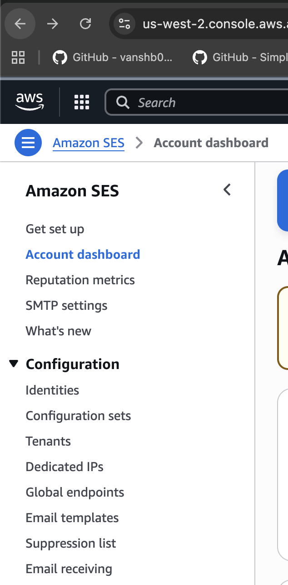
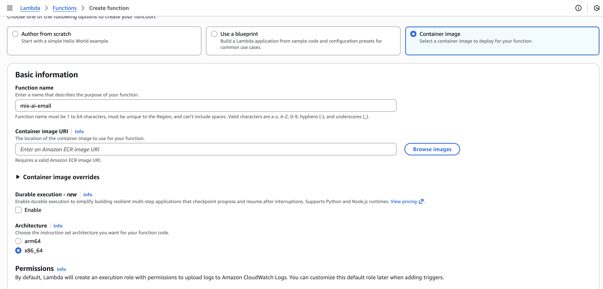
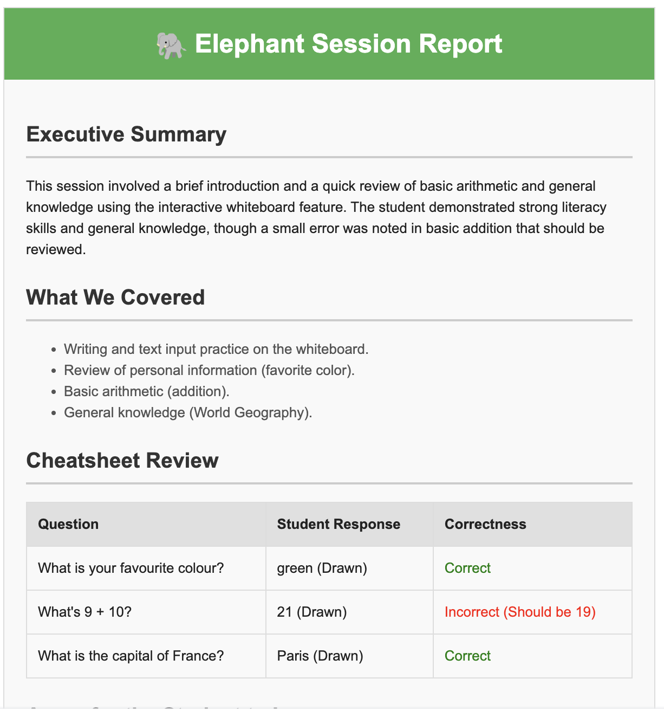

# Automated Email Summary

This here is a lil' bonus feature now that you have all this infrastructure set up. In one lambda, you can process the MKV file resulting from the session (I use the teacher one) to mix the audio channels, and then send it to Gemini, which handles video submissions by capture a frame for every second of video and interleaving it with the transcript. Then Gemini can return inline HTML, which is the accepted format by email clients for rendering impressive visuals, such as with newsletters.

This Lambda is triggered from DynamoDB stream events (just like the termination lambda). It's triggered automatically when session data is uploaded to S3 and written to DynamoDB.

!!! info "Note - Docker-based Lambda"
    This Lambda uses a Docker container image because it requires FFmpeg for video processing and the Gemini API. The container includes FFmpeg binaries and Python dependencies. When dependencies are needed outside the ones packaged with the Lambda environment, you have to use a Dockerfile and deployment script. This approach allows you to version control locally, which solves the issue of having different snapshots of the lambda locally vs the cloud.

## Enable SES

SES (Simple email service) is a way for you to send emails via AWS services. You need to get approved to use it in production (and you might need a business email), but for the sake of testing, you can use sandbox right away. We'll use sandbox.



- Go select identities, and then hit the Orange 'Create Identity' button.
- Select the Email Address radio button
- Enter your email address and confirm

This will allow you to send sandbox emails to your personal email.

## Create a new lambda



You'll need to create a new blank lambda, and select Container image. Use these settings here. You basically just need to pick a name and architecture (I always go x86_64).

## Structure of the directory

Here's what the directory looks like:

``` plantext
lambdas/mix-ai-email/
├── Dockerfile             # Container image definition
├── lambda_function.py     # Main Lambda handler code
├── requirements.txt       # Python dependencies
└── deploy.sh              # Deployment script for building and pushing
```
## Environment Variables

| **Key**            | **Value**                  |
| ------------------ | -------------------------- |
| **GEMINI_API_KEY** | Your Google Gemini API key |

!!! info "Note - Gemini API Key"
    You'll need to obtain a Gemini API key from Google Cloud Console. This is super easy and you get 20 free requests per day. Sick!

## DynamoDB Stream Trigger

This Lambda is triggered by DynamoDB Streams. You need to configure the stream trigger in the Lambda console:

1. Go to your Lambda function in the AWS Console.
2. Click **Add trigger**.
3. Select **DynamoDB**.
4. Choose your `elephant-meetings` table.
5. Set **Batch size** to `10` (or your preference).
6. Enable the trigger.

!!! info "Note - Stream Events"
    The Lambda processes `INSERT` and `MODIFY` events from DynamoDB. It looks for records where `teacher_session_data` contains an S3 URL and `teacher_email` is present.

## Code Breakdown

```python title="Initial Setup"
OUTPUT_BUCKET = "elephant-bucket-ai-summaries"
GEMINI_API_KEY = os.getenv("GEMINI_API_KEY")
genai.configure(api_key=GEMINI_API_KEY)

s3 = boto3.client('s3')
ses = boto3.client('ses')
```

- `OUTPUT_BUCKET` is where the generated HTML reports are stored. This is totally optional, I just thought it might be useful for debugging.
- `genai` is the Google Generative AI library, configured with your API key.
- `ses` is AWS Simple Email Service for sending emails.

```python title="Lambda Handler - Stream Processing"
def lambda_handler(event, context):
    for record in event['Records']:
        if record['eventName'] in ['INSERT', 'MODIFY']:
            new_image = record['dynamodb']['NewImage']
            s3_url = new_image.get('teacher_session_data', {}).get('S', '')
            email = new_image.get('teacher_email', {}).get('S', '')
            
            if not email:
                print("No teacher email found, skipping lambda")
                continue
```

!!! info "Note - Early Exit Optimization"
    The Lambda skips processing if no teacher email is found. This saves compute costs by avoiding unnecessary video processing when emails aren't needed. You could even make it conditional such that if there isn't student and teacher data, it does nothing.

```python title="S3 URL Parsing"
if s3_url.startswith('s3://'):
    # Handle "s3://bucket/key"
    parts = s3_url.replace("s3://", "").split("/", 1)
    input_bucket = parts[0]
    input_key = parts[1]

elif s3_url.startswith('https://'):
    # Handle "https://bucket.s3.region.amazonaws.com/key"
    parsed = urlparse(s3_url)
    input_bucket = parsed.netloc.split('.')[0]
    input_key = parsed.path.lstrip('/')
```

- The Lambda handles both `s3://` and `https://` S3 URL formats.
- It extracts the bucket name and object key for downloading.

```python title="Session Processing Flow"
def process_session(bucket, key, teacher_email, student_name):
    # A. Download ZIP from S3
    s3.download_file(bucket, key, local_zip)
    
    # B. Unzip & Find MKV
    with zipfile.ZipFile(local_zip, 'r') as zip_ref:
        zip_ref.extractall(extract_dir)
    
    # C. Fuse Audio Tracks
    fuse_audio_tracks(local_input_mkv, local_fused)
    
    # D. Upload to Gemini
    video_file = genai.upload_file(path=local_fused)
    
    # E. Generate HTML Report
    model = genai.GenerativeModel(model_name="gemini-flash-latest")
    response = model.generate_content([video_file, prompt])
    
    # F. Save Report to S3
    s3.put_object(Bucket=OUTPUT_BUCKET, Key=output_key, Body=html_content)
    
    # G. Send Email via SES
    send_email_via_ses(teacher_email, html_content, student_name)
```

!!! tip "Awesome - Complete Automation"
    This Lambda automates the entire workflow: download, process, analyze, store, and email. This borders on "god lambda" which might not be ideal for production, BUT it's fast and simple for our purposes

### Audio Fusion Logic

```python title="Fuse Audio Tracks"
def fuse_audio_tracks(input_path, output_path):
    # 1. FFprobe: Find all audio tracks
    cmd_probe = ['ffprobe', '-v', 'quiet', '-print_format', 'json', 
                 '-show_streams', str(input_path)]
    
    # 2. Build FFmpeg Command
    if len(audio_indices) > 1:
        # Complex Mix: Multiple audio tracks
        inputs = "".join([f"[0:a:{i}]" for i in audio_indices])
        filter_complex = f"{inputs}amix=inputs={len(audio_indices)}[a_out]"
    else:
        # Simple Case: Downmix to mono
        ffmpeg_cmd.extend(['-ac', '1'])
```

!!! info "Note - Audio Processing"
    The Lambda uses FFmpeg to mix multiple audio tracks (teacher and student) into a single track. This ensures Gemini can process the complete audio context. If there's only one track, it downmixes to mono for compatibility.

### Gemini AI Analysis

```python title="AI Prompt"
prompt = """
You are an expert educational analyst. 
Analyze the video and generate a **formatted HTML email body** for the student.

STYLING:
- Use inline CSS (e.g., <div style='font-family: sans-serif; max-width: 600px; margin: auto; border: 1px solid #ddd; padding: 20px;'>).
- Header: '🐘 Elephant Session Report' (Green background #4CAF50, white text).
- Content: Executive Summary, What We Covered (Bullets), Cheatsheet (HTML Table with Question, Student Response, Correctness), Areas for the Student to Improve.
- No Markdown. No LaTeX. Raw HTML only.
"""
```

### Email Sending

```python title="SES Email Configuration"
def send_email_via_ses(recipient, html_body, student_name):
    sender = "Elephant AI <christardy99@gmail.com>"
    subject = f"Your Tutoring Session Recap with {student_name}"
    
    # Add List-Unsubscribe header for email compliance
    msg.add_header('List-Unsubscribe', unsub_header)
    msg.add_header('List-Unsubscribe-Post', 'List-Unsubscribe=One-Click')
    
    # Send via SES
    ses.send_raw_email(
        Source=sender,
        Destinations=[recipient],
        RawMessage={'Data': msg.as_string()}
    )
```

!!! info "Note - Email Compliance"
    The Lambda includes `List-Unsubscribe` headers required by email providers like Gmail. This ensures emails aren't marked as spam and comply with email marketing regulations.

## Docker Deployment

This Lambda uses a Docker container because it requires FFmpeg. The deployment process:

### Dockerfile Structure

```dockerfile title="Dockerfile"
FROM public.ecr.aws/lambda/python:3.14

# Install system tools (unzip is critical)
RUN dnf install -y wget tar xz unzip

# Install Static FFmpeg
RUN wget https://johnvansickle.com/ffmpeg/releases/ffmpeg-release-amd64-static.tar.xz \
    && tar -xf ffmpeg-release-amd64-static.tar.xz \
    && mv ffmpeg-*-amd64-static/ffmpeg /usr/bin/ffmpeg \
    && mv ffmpeg-*-amd64-static/ffprobe /usr/bin/ffprobe \
    && chmod +x /usr/bin/ffmpeg /usr/bin/ffprobe

# Python Dependencies
COPY requirements.txt ${LAMBDA_TASK_ROOT}
RUN pip install -r requirements.txt

# Lambda Code
COPY lambda_function.py ${LAMBDA_TASK_ROOT}
```

!!! info "Note - FFmpeg Installation"
    The Dockerfile installs a static FFmpeg binary that doesn't require system libraries. This ensures video processing works reliably in the Lambda environment.

### Deployment Script

The `deploy.sh` script handles:
1. Building the Docker image for Lambda (AMD64 platform)
2. Pushing to Amazon ECR (Elastic Container Registry)
3. Updating the Lambda function code

```bash title="Deploy Command"
./deploy.sh
```

!!! warning "Warning - AWS CLI Requirements"
    You'll need to install the AWS CLI to run the deployment script. You'll probably run into AWS CLI permissions issues, because you'll need IAM permissions not yet configured. I would just say to address them as they come up.

## IAM Role

- **AWSLambdaBasicExecutionRole**, pre-built by AWS
- **S3ReadWrite**, custom inline policy
- **SESEmailSend**, custom inline policy
- **DynamoDBStreamRead**, custom inline policy

```json title="S3ReadWrite Policy"
{
    "Version": "2012-10-17",
    "Statement": [
        {
            "Effect": "Allow",
            "Action": [
                "s3:GetObject",
                "s3:PutObject"
            ],
            "Resource": [
                "arn:aws:s3:::elephant-bucket-ai-summaries/*",
                "arn:aws:s3:::your-session-bucket/*"
            ]
        }
    ]
}
```

```json title="SESEmailSend Policy"
{
    "Version": "2012-10-17",
    "Statement": [
        {
            "Effect": "Allow",
            "Action": [
                "ses:SendEmail",
                "ses:SendRawEmail"
            ],
            "Resource": "*"
        }
    ]
}
```

```json title="DynamoDBStreamRead Policy"
{
    "Version": "2012-10-17",
    "Statement": [
        {
            "Effect": "Allow",
            "Action": [
                "dynamodb:DescribeStream",
                "dynamodb:GetRecords",
                "dynamodb:GetShardIterator",
                "dynamodb:ListStreams"
            ],
            "Resource": "arn:aws:dynamodb:us-west-2:*:table/elephant-meetings/stream/*"
        }
    ]
}
```

!!! warning "Warning - SES Verification"
    Before sending emails, you must verify your sender email address in SES. Go to SES Console > Verified identities and verify `christardy99@gmail.com` (or your sender email). If you're in the SES sandbox, you'll also need to verify recipient addresses.

## Resource Configuration

### Memory and Timeout

- **Memory:** `3008 MB` (recommended for video processing)
- **Timeout:** `15 minutes` (maximum Lambda timeout)

!!! info "Note - Resource Requirements"
    Video processing and AI analysis are compute-intensive. Higher memory allocation helps with FFmpeg processing and reduces execution time.

### Ephemeral Storage

- **Ephemeral Storage:** `10240 MB` (10 GB)

!!! info "Note - Storage Requirements"
    The Lambda downloads ZIP files, extracts videos, and processes them. Larger storage prevents out-of-space errors during processing.

## Testing

After deploying the Lambda and configuring the DynamoDB stream trigger, you can verify that everything is working correctly by checking CloudWatch logs and the resulting email output.

### CloudWatch Logs

To monitor the Lambda execution and debug any issues, access CloudWatch logs through the Lambda console:

1. Go to your Lambda function in the AWS Console.
2. Click on the **Monitor** tab.
3. Click **View CloudWatch logs** to see detailed execution logs.


The logs will show:
- Stream event processing
- S3 download progress
- FFmpeg audio fusion status
- Gemini API upload and processing
- Email sending confirmation
- Any errors or warnings

!!! tip "Awesome - Debugging Tips"
    If the Lambda fails, check the CloudWatch logs for specific error messages. Common issues include missing S3 permissions, invalid Gemini API key, or SES verification problems.

### Email Output

When the Lambda successfully processes a session, it sends a formatted HTML email report to the teacher. The email includes:

- **Executive Summary** - Overview of the session
- **What We Covered** - Bullet points of topics discussed
- **Cheatsheet** - HTML table with questions, student responses, and correctness
- **Areas for Improvement** - Actionable feedback for the student



Nice! And that's our basic AI summary.

---

**Next: [AppLocker Configuration →](applocker.md)**

